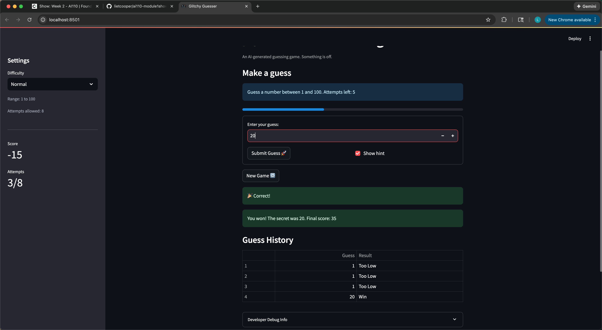

# 🎮 Game Glitch Investigator: The Impossible Guesser

## 🚨 The Situation

You asked an AI to build a simple "Number Guessing Game" using Streamlit.
It wrote the code, ran away, and now the game is unplayable. 

- You can't win.
- The hints lie to you.
- The secret number seems to have commitment issues.

## 🛠️ Setup

1. Install dependencies: `pip install -r requirements.txt`
2. Run the broken app: `python -m streamlit run app.py`

## 🕵️‍♂️ Your Mission

1. **Play the game.** Open the "Developer Debug Info" tab in the app to see the secret number. Try to win.
2. **Find the State Bug.** Why does the secret number change every time you click "Submit"? Ask ChatGPT: *"How do I keep a variable from resetting in Streamlit when I click a button?"*
3. **Fix the Logic.** The hints ("Higher/Lower") are wrong. Fix them.
4. **Refactor & Test.** - Move the logic into `logic_utils.py`.
   - Run `pytest` in your terminal.
   - Keep fixing until all tests pass!

## 📝 Document Your Experience

- [x] Describe the game's purpose.
   
   This is a guessing game, allowing users to make guess of a secret numebr within a certain numebr of attemps and given ranges.
- [x] Detail which bugs you found.
  1. Pressing Enter does not apply the input.
  2. The number range of different difficulty level in the info section does not correspond with that in the side bar, so does the secrete number.
  3. When guessing a number, the number is not shown in the developer debug info history immediately after click submit, but only shown at nect click.
  4. The hints for guessing is converse – if the user inputs a lower number, it prompts the user to go hihger, and vice versa.
  5. The New Game button does not really refresh and starts a new game. All previous record persists.
- [x] Explain what fixes you applied.
   
   - fixed all of them.

## 📸 Demo

- [x] [Insert a screenshot of your fixed, winning game here]

## 🚀 Stretch Features

- [x] [If you choose to complete Challenge 4, insert a screenshot of your Enhanced Game UI here]
